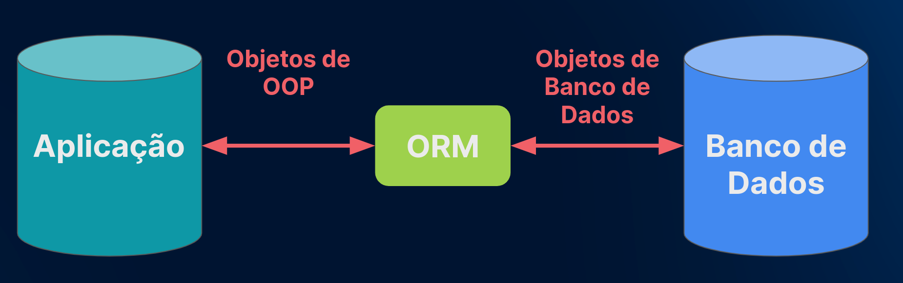

<h1>Formação Django</h1>

<h2>Django: templates e boas práticas</h2>

* Django é um framework orientado a **conteúdo**.

* É baseado na arquitetura MVT (baseado no MVC)

* É o framework perfeito para aplicações fullstack (Front e Back-End no mesmo lugar, arquitetura monolítica talvez?)

* Comando para ver comandos do django ```django-admin help```

* Pode ser iniciado com a _virtualenv_, uma lib de python feita especialmente para criar ambientes virtuais. Ela se destaca da venv (que é nativa já do python e é uma parte menor da virtualenv) pelos fatos:
    * Possui maior velocidade
    * Pode criar ambientes virtuais independente da versão do Python instalada na máquina
    * Pode ser atualizado pelo pip
    * Possui uma Programmatic API, capaz de descrever um ambiente virtual sem criá-lo.
´

* Boa prática para iniciar um projeto Django é chamá-lo de _setup_ e colocar um ponto depois, apra não criar o nome do projeto de setup e uma pasta setup dentro dele:
```python
django-admin startproject setup .
```

* É possível mudar a referência da linguagem e timezone para o do Brasil, sendo LANGUAGE_CODE = 'pt-br' e TIME_ZONE = 'America/Sao Paulo'

* É fundamental criar variáveis de ambientes para presservar a segurança da aplicação

* Pode-se pegar templates já prontos de gitignore para um framework ou linguagem em gitignore.io

* Comando de ajuda do django:
```python
python manage.py help
```

* Comando para criar um novo app (adicionar o app depois em settings.py):
```python
python manage.py startapp <nome_do_app_novo>

# Em settings.py
INSTALLED_APPS = [
    'django.contrib.admin',
    'django.contrib.auth',
    'django.contrib.contenttypes',
    'django.contrib.sessions',
    'django.contrib.messages',
    'django.contrib.staticfiles',
    '<nome_do_app_novo>',
]
```
* O nome 'index' se refere a página principal da aplicação

* **views.py**: É o arquivo que será responsável por conter funções que são invocadas ao acessar uma rota específica da aplicação para mostrar uma determinada página.

* **urls.py**: É o arquivo que será responsável por definir quais rotas existem dentro da aplicação e o que é retornado/ativado caso uma rota seja chamada no navegador. É uma excelente prática _isolar as URLS dos apps_. Para isso:
    * Pode ser criado em cada app o arquivo **urls.py**.
    * Usar o include('nome_do_app.urls') para incluir no urls.py base todas as rotas de nome_do_app. A função vem de django.urls

* Em **settings.py**, existe já uma configuração para templates. Nela você tem várias opções, uma delas é definir o diretório de onde elas estarão. Então é ideal criar uma pasta chamada _templates_ (como se fosse um app, ou seja, no nível da aplicação) e adicionar o se caminho no settings.py:
```python
# Em settings.py
TEMPLATES = [
    {
        'BACKEND': 'django.template.backends.django.DjangoTemplates',
        'DIRS': [os.path.join(BASE_DIR, 'templates')], ## Aqui
        'APP_DIRS': True,
        'OPTIONS': {
            'context_processors': [
                'django.template.context_processors.debug',
                'django.template.context_processors.request',
                'django.contrib.auth.context_processors.auth',
                'django.contrib.messages.context_processors.messages',
            ],
        },
    },
]

# Em views.py
def index(request):
    return render(request, 'index.html')
```

* Por boas práticas, é ideal deixar uma apsta de templates para todo o projeto, onde todas as suas aplicações irão carregar seus templates específicos
```
nome_projeto/templates/nome_app
```

* É interessante também colocar uma pasta 'apps' para todos os apps que serão criados no projeto.

* Para arquivos estáticos (arquivos que não são modificados dinamicamente pelo servidor web como imagens, estilos, scripts JS), precisa-se setar também um caminho para estes. Por padrão, já existe a STATIC_URL, uma variável em **settings.py** que contém o caminho da pasta static.

* A pasta _static_ deverá ser criada manualmente dentro do app base (_setup_ no caso) e deve-se colocar

```python

STATIC_URL = 'static/'

// Diretório normal de onde estão todos os arquivos
// estáticos da aplicação
STATICFILES_DIRS = [
    os.path.join(BASE_DIR, 'setup/static'),
    // Pode-se criar outras pastas static dentro de
    // outros apps, basta adicionar o caminho aqui
]

// Caminho de onde o Django automáticamente irá
// manipular a localização de cada arquivo estático
STATIC_ROOT = os.path.join(BASE_DIR, 'static')
```

* Com o _STATIC_ROOT_, mesmo se houverem arquivos de nomes iguais em statics de outros apps, eles não serão confundidos, pois o Django saberá a que app cada um pertence.

* Para que o Django endereçe de fato os arquivos estáticos dentro da aplicação após seguir o passo anterior, basta digitar:

```python
python manage.py collectstatic
```

* A partir daí, o Django criará uma pasta _static_ na base do projeto mesmo, sendo esta que será usada pelos templates da aplicação.

* Existe diferenças entre a pasta static criada manualmente e a static criada pelo comando _collectstatic_, a que está dentro da pasta de setup se refere a static dentro do ambiente de desenvolvimento e a outra para o ambiente de produção. Então **só se deve fazer novas modificações dentro desta pasta de desenvolvimento.**

* Agora para usar os arquivos estáticos nos templates, podemos trocar as referências diretas para esses arquivos pela tag:

```python
// No arquivo template
 // Colocada no topo do arquivo de template


// No views.py
def view_tal(request):
    return render(request, 'nome_app/template_tal.html')
```

* Saber entender o que é o Jinja2 (parece que é de onde vem as tags do Django)

* É possível de colocar referências de urls que já estão cadastradas na aplicação dentro de elementos \<a> da aplicação. Isso é possível através da propriedade _name_, no registro de uma url.

```python
# Em arquivos urls.py
urlpatterns = [
    path('admin/', admin.site.urls),
    path('', include('galeria.urls'), name='o_que_quiser'),
]
```

```html
<!-- No template desejado -->
<a href="">
<a href="">
```

* Sempre buscar utilizar o conceito DRY (Don't Repeat Yourself). Para aplicá-lo em Django, podemos criar um arquivo base que poderá ser utilizado dentro de vários templates (pode ter o nome base.html).
    1. Dentro deste novo template base.html, copiar tudo o que haverá repetição (fechar tags se necessário)

    2. Dentro do template que usará o base.html, _extendê-lo_ e carregar seus arquivos estáticos juntos:
    
    ```html
    
    
    ```

    3. Agora no base.html, deve ser criado um _bloco_ onde haverá o conteúdo de qualquer template de que se deseja processar (dentro do body):

    ```html
    <body>
        
    <body>
    ```

    4. Agora no template, definir novamente o mesmo bloco, só que agora para todo o conteúdo do html em questão, podendo ser removido as tags de \<body> e \<html>, que já estão no base.html (a tag deverá estar no começo do arquivo html)

    ```html
    
    
    
    ...
    
    ```

* Para itens que também se repetem em múltiplos templates mas que não necessáriamente em todos, como um rodapé ou uma barra lateral, podemos importar apenas _partes parciais_ de HTMLs.
    1. Criar uma pasta 'parcials' dentro da pasta do app que se deseja usar dentro de templates (se todos os apps utilizarem, coloque na base msm)

    2. O nome do elemento deverá começar com um underline (é um padrão). Ex: _footer.html

    3. _Incluir_ dentro do base.html daquele app (ou do geral se todos os templates o utilizarem):

    ```html
    
    ```

    4. Agora todos os que utilizam o base.html terão por padrão as coisas incluídas!


* <a href="https://www.youtube.com/watch?v=x39vqeBTUmE&ab_channel=Alura">Link para ver o que é ORM</a>

* Imagem com o funcionamento de uma ORM:


<h2>Django: persistência de dados e Admin</h2>

* A função \__str__() é usada para definir como o objeto será printado, então ao redefinir ela, se redefinie como o objeto é printado em print().

* Alguns comandos de linha do manage.py:

    * makemigrations: "Tudo o que está definido nas models.py de todos os apps seja transformado em tabelas de banco de dados"

    * migrate: "Aplica todas as modificações que foram criadas a partir da _makemigrations_."

    * shell: Abre um shell iterativo da própria aplicação Django.
        * Para criar um novo registro para uma model (tabela) do BD, fazer assim dentro do shell:
        ```python
        from app.models import Modelo_desejado

        objeto_registro = Modelo_desejado(attr1="asasas", attr2="asdhjdsa")
        objeto_registro.save()

        #Para ver os objetos salvos dentro do modelo(tabela)
        Modelo_desejado.objects.all()
        ```

* É uma boa prática ao invés de deixar somente o nome do app criado em INSTALLED_APPS no settings.py, deixar desta forma:

```python
INSTALLED_APPS = [
    'django.contrib.admin',
    'django.contrib.auth',
    'django.contrib.contenttypes',
    'django.contrib.sessions',
    'django.contrib.messages',
    'django.contrib.staticfiles',
    '<nome_do_app_novo>'.apps.NomeDoAppNovoConfig, #Nome da classe dentro do apps.py do app respectivo
]
```
* Assim, o arquivo de configurações apps.py é puxado, que por sua vez puxa todo o app.

* <a href="https://docs.djangoproject.com/pt-br/4.1/topics/db/models/">Documentação Oficial Django sobre Models</a>

* Para acessar valores de colunas de objetos de uma model em um HTML (template), utiliza-se tags especiais do Django para tais:

```python
# No views.py
from app_tal.models import ModelTal

def uma_view_qq(request):
    objetos_desejados = ModelTal.objects.all() # Coleta todos os objetos desta tabela/model (retorna um QuerySet)
    
    # Para se passar estes dados para o HTML, primeiro se cria o que chamamos de 'contexto' que o Django irá traduzir para o HTML ler
    contexto = {
        "objetos" : objetos_desejados
    }

    return render(request, 'nome_app/template_tal.html', contexto)
```

```html
<!-- No template.html -->
<div>
        <!-- Verifica se a lista está vazia ou se existe essa variável no contexto trazido pela view que chamou o template -->
       <!-- Itera sobre a lista de objetos -->
    <h2 class="titulo">{{ item.attr1 }}</h2>    <!-- Acessa o attributo desejado do objeto da iteração atual -->
    <p class="paragrafo">{{ item.attr2 }}</p>
        <!-- Encerra o loop -->
    
         <!-- Encerra a condicional -->
</div>
```

* As tags Django também podem substituir também strings em imports estáticos:

```html
<!-- Não pode ter espaço entre o fim da tag '%}' e o início da tag '{{', para que não haja o caracter de espaço no meio da string da src -->

```

* Também é possível passar argumentos pela própria URL para serem usados em uma view:

```python
# Na urls.py do app_tal
urlpatterns = [
    path('', index, name='index'),
    path('caminho_1/<int:id_tal>', view_tal, name='caminho_1')
]

# Na views.py do app_tal
def index(request):
    return render(request, 'nome_app/template_tal.html')

def view_tal(request, id_tal):  # Recebe o argumento definido na urls.py para esta rota que chama esta view
    # Função nativa do Django que pega um único objeto de uma model e verifica se existe ou não
    objeto = get_object_or_404(Fotografia, pk=id_tal) 

    contexto = {
        'objeto' : objeto,
    }

    return render(request, 'nome_app/template_tal2.html', contexto)
```

```html
<!-- No template_tal.html -->
<!-- É possível adicionar argumentos a esta tag, no caso está sendo passado o id do objeto fotografia vindo do contexto -->
<!-- O resultado seria: ip:porta/.../imagem/id_da_foto , então ao clicar neste <a>, a página é redirecionada para a imagem com tal id -->
<a href=""> 
```

* Para facilitar na adição/remoção/edição de itens no banco de dados, podemos utilizar o módulo de <a href="https://docs.djangoproject.com/en/4.1/ref/contrib/admin/">_Admin_ do Django</a>. Para poder manuseá-lo dentro da aplicação, precisa-se primeiro criar um _super usuário_. Após isso, basta logar na rota base '(ip:porta)/admin'

```python
python manage.py createsuperuser
```

* O Django também cria por automático o arquivo admin.py dentro de cada novo app criado. Para adicionar uma model para ser manuseada, precisa-se registrar a model desejada dentro deste arquivo:

```python
# Dentro de admin.py do app_tal
from django.contrib import admin
from app_tal.models import ModelTal

# Classe que pode ser criada para configurar a visualização de objetos de uma ou mais models dentro da página de admin 
class ListandoObjetos(admin.ModelAdmin):
    list_display = ("id", "nome", "legenda")    # Colunas dos objetos da model que são mostradas 
    list_display_links = ("id", "nome")         # Colunas dos objetos da model que, ao clicar, levarão ao registro do item
    search_fields = ("nome",)                   # Adiciona possibilidade de pesquisar registros por uma ou mais colunas (precisa ter vírgula no final caso seja somente um argumento, pois é uma tupla)
    list_filter = ("categoria",)                # Adiciona filtragem por lista como uma barra lateral
    list_per_page = 10                          # Adiciona paginação

# Caso se deseje mostrar a visualização padrão para models no admin
# admin.site.register(ModelTal)

# Caso se deseje mostrar a visualização customizada pela classe criada no admin
admin.site.register(ModelTal, ListandoObjetos)
```

* Para se definir valores específicos para uma coluna (um domínio de valores), pode-se fazer: 

```python
# Em models.py do app_tal
from django.db import models

class ModelTal(models.Model):
    # Define as opções de valores que a coluna de 'categorias' pode ter
    OPCOES_CATEGORIAS = [
        ("NEBULOSA", "Nebulosa"),
        ("ESTRELA", "Estrela"),
        ("GALÁXIA", "Galáxia"),
        ("PLANETA", "Planeta")
    ]

    att1 = models.CharField(max_length=100, null=False, blank=False)
    att2 = models.CharField(max_length=150, null=False, blank=False)
    categoria = models.CharField(max_length=100, null=False, blank=False, choices=OPCOES_CATEGORIAS, default='')    # Precisa ter um default caso tenha o atributo choices
    att3 = models.TextField(null=False, blank=False)
    att4 = models.CharField(max_length=100, null=False, blank=False)

    def __str__(self):
        return f"Objeto [nome={self.att1}]"
```

* **OBS: TODA MUDANÇA FEITA DENTRO DE UMA MODEL DEVERÁ SER SEGUIDA DE MAKEMIGRATIONS->MIGRATE, PARA QUE O BD E APLICAÇÃO TENHAM A MESMA TABELA E MODEL SINCRONIZADOS**

* Podemos filtrar os itens que gostaríamos de retirar da nossa models/tabela no DB. Podemos utilizar o ModelTal.objects.filter(atributos=valor_desejado)

* Para ordenar os registros que vem do DB, basta utilizar o método *order_by("atributo_desejado")* para ordem crescente. Para ordem decrescente, basta colocar *order_by("-atributo_desejado")*.

* Para permitir upload de arquivos no Django (no caso aqui imagens), é necessário seguir os passos:
    1. Modificar o settings.py, criando uma referência para arquivos de mídia:
    ```python
    MEDIA_ROOT = os.path.join(BASE_DIR, "media")
    MEDIA_URL = "/media/"

    # A pasta será criada automaticamente no caso de algum upload
    ```

    2. Adicionar no urls.py do **setup** o caminho especificado no passo (1):
    ```python
    from django.contrib import admin
    from django.urls import path, include
    from django.conf import settings
    from django.conf.urls.static import static


    urlpatterns = [
        path('admin/', admin.site.urls),
        ...
    ] + static(settings.MEDIA_URL, document_root=settings.MEDIA_ROOT)
    ```

    3. Alterar o campo na model desejada do qual se deseja ser a coluna de arquivo de mídia:
    ```python
    # Numa models.py aí:
    ...
    attrMedia = models.ImageField(upload_to="fotos/%y/%m/%d/", blank=True) # Permite fazer upload par uma pasta com ano, mês e dia específico
    ...
    ```

    4. Colocar esta imagem para aparecer no template que se deseja (boas práticas para caso se a imagem não existir, substituindo por outra imagem default):
    ```html
    
        
    
           <!-- Pega a URL da foto enviada por upload para dentro do projeto -->
    
    ```

* A parte fotografia.foto.url do código HTML é uma expressão Django que recupera a URL da imagem. A variável fotografia é um objeto que representa a fotografia, e a propriedade foto é um objeto que representa a imagem da fotografia. A propriedade url da imagem é a URL da imagem. Quando o código HTML é renderizado, a expressão fotografia.foto.url é avaliada e a URL da imagem é retornada. A URL da imagem é então usada como o valor do atributo src do elemento img. O atributo src do elemento img especifica a URL da imagem que deve ser exibida.

* É possível que a Django-tag de url seja no formato  VERIFICAR

* O ModelTal.objects.get() retorna um objeto/registro da model. O ModelTal.objects.filter() retorna um queryset, uma lista de dicts dom os tributos de cada registro filtrado.

* <a src="https://developer.mozilla.org/pt-BR/docs/Learn/Server-side/Django/Authentication">Como criar páginas de autenticação no Django (se quiser entender o projeto, vai ter que ler o que tem antes XD)</a>

<h2>Django: autenticação de formulários e alerta</h2>

* É possível que um projeto esteja sendo desenvolvido numa versão do Python diferente da sua, então para isso, pode-se buscar utilizar outro interpretador Python para este. No caso do VSCode, basta Ctrl+Shift+P e digitar escolher interpretador. Depois, localizar e acessar a pasta do ambiente virtual do projeto em questão, selecionandoo **python.exe** dele.

* É uma boa prática todo app ter uma _urls.py_ dentro de si. O _urls.py_ do setup terá somente o include dos apps, com a string de urls vazia.

* É uma boa prática criar um arquivo para formulários em páginas que tenham esse recurso (como login por exemplo). O arquivo deve se chamar _forms.py_ e deverá ser importado para a view respectiva que o irá usar.

```python
# Na forms.py dentro de um app_tal
from django import forms

class FormTal(forms.Form):
    campo1 = forms.CharField(
        label="Campo 1",    # O que irá aparecer na página
        required=True,
        max_length=100,
    )

    campoSenha = forms.CharField(
        label="Senha",
        required=True,
        max_length=70,
        widget=forms.PasswordInput()        # Adiciona a configuração de um campo de senha (caracteres ocultos)
    )


# Na views.py dentro do mesmo app_tal
def view1(request):
    formTal = FormTal()
    
    contexto = {
        form_tal = form_tal,
    }

    return render(request, "caminho/template.html", contexto)

```

* Para fazê-lo aparecer na página, podemos colocar assim:
```html
(...)

<form action="" method="">
            <!-- PRECISA VIR DEPOIS DA TAG DE FORMULÁRIO -->
    
    <div>
        <label for="{{ field.id_for_label }}">{{ field.label }}</label>
        {{ field }}
    </div>
      
    <div>
        <button type="submit">Logar</button>
    </div>
</form>

(...)
```

* Os forms podem ser estilizados tanto no HTML quanto no próprio form!

```python
# Na forms.py dentro de um app_tal
from django import forms

class FormTal(forms.Form):
    campo1 = forms.CharField(
        label="Campo 1",    # O que irá aparecer na página
        required=True,
        max_length=100,
    )

    campoSenha = forms.CharField(
        label="Senha",
        required=True,
        max_length=70,
        widget=forms.PasswordInput(
            attrs={         # Usado para aplicar confgurações HTML e CSS no elemento do formulário
                'class':'form-control',
                'placeholder': 'Digite a senha',
            })        # Adiciona a configuração de um campo de senha (caracteres ocultos)
    ) 
```

```html
<!-- No caso aqui, está sendo usado as classes do bootstrap para estilização -->
<form action="" method="">
            <!-- PRECISA VIR DEPOIS DA TAG DE FORMULÁRIO -->
    <div class="row">
        
        <div class="col-12 col-lg-12" style="margin-bottom: 10px;">
            <label for="{{ field.id_for_label }}" style="color:#D9D9D9; margin-bottom: 5px;">{{ field.label }}</label>
            {{ field }}
        </div>
                           
    </div>
    <div>
        <button type="submit" class="btn btn-success col-12" style="padding: top 5px;">Logar</button>
    </div>
</form>
```

* <a href="https://cursos.alura.com.br/course/django-autenticacao-formularios-alerta/task/119348">Sobre o token CSRF</a>

* O Django possui embutido um sistema e models de usuários do sistema, então não se precisa criar uma models para ele, mas pode-se criar um app que cuide de infos de usuários. O pacote 'auth' do Django já possui implementado em si vários elementos que auxiliam no sistema de login e cadastro de novos usuários, inclusive em aspectos de segurança também.

* É uma boa prática ao prgramar em python é colocar a condição negativa primeiro antes da desejada para agilizar a leitura do código

* Para que mensagens de login/registro de usuários apareçam para o usuário, precisa-se além de importar o pacote de mensagens do Django auth, também colocar esta mensagem nos templates relativos a login/cadastro, indicando onde e como essas mensagens aparecerão.

* Conseguimos realizar associações entre tabelas através da funcionalidade de chave primária e estrangeira do Django. Para isso, definimos o atributo que será a chave estrangeira na model em questãoe a tabela a qual ela faz referência:

```python
from django.contrib.auth.models import User


class ModelTal(models.Model):
    attr1 = models.CharField(max_length=100, null=False, blank=False)
    attr2 = models.CharField(max_length=150, null=False, blank=False)
    usuario_ref = models.ForeignKey(    # Cria relação de chave estrangeira com outra model (no caso aqui com User)
        to=User,
        on_delete=models.SET_NULL,
        null=True,
        blank=False,
        related_name='user',        # Nome mais fácil para a chave
    )

```

* É possível fazer validações de campo dentro de formulários do Django, como regras para senha ou formato de nome de usuário por exemplo:

```python
class CadastroForms(forms.Form):
    nome_cadastro=forms.CharField(
        label="Nome de Cadastro",
        required=True,
        max_length=100,
        widget=forms.TextInput(
            attrs={
                'class':'form-control',
                'placeholder': 'Ex. João da Silva',
            }
        )        
    )

    senha_1 = forms.CharField(
        label="Senha",
        required=True,
        max_length=70,
        widget=forms.PasswordInput(     # Adiciona a configuração de um campo de senha (caracteres ocultos)
            attrs={
                'class':'form-control',
                'placeholder': 'Digite a senha',
            }
        )        
    )

    senha_2 = forms.CharField(
        label="Confirme a Senha",
        required=True,
        max_length=70,
        widget=forms.PasswordInput(     # Adiciona a configuração de um campo de senha (caracteres ocultos)
            attrs={
                'class':'form-control',
                'placeholder': 'Digite novamente a senha',
            }
        )        
    )

    # (...) Outros campos (...)

    # O nome do método precisa ter esse formato para ser reconhecido pelo Django: clean_<nome_atributo_referente>
    def clean_nome_cadastro(self):  
        nome = self.cleaned_data.get("nome_cadastro")

        if nome:
            nome = nome.strip()

            # Verifica se o nome inserido (após o strip()) é válido, não tendo espaços dentro dele 
            if ' ' in nome:
                # Lança uma exceção dizendo o erro que ocorreu
                raise forms.ValidationError("Não é permitido espaços neste campo!")
            else:
                # Retorna o nome validado corretamente
                return nome

    # Verificação de senhas iguais
    def clean_senha_2(self):
        senha_1 = self.cleaned_data.get("senha_1")
        senha_2 = self.cleaned_data.get("senha_2")

        if senha_1 and senha_2:
            if senha_1 != senha_2:
                raise forms.ValidationError('Senhas não são iguais')
            else:
                return senha_2

```

* Além das validações de formulário, é possível usar as **mensagens** para declarar erros ou acertos dentro de views ao serem chamadas. 
```py
from django.contrib import auth, messages   # Libs de autenticação e de mensagens de login

def view_tal(request):
    # Não permite o usuário a acessar essa view se não estiver logado
    if not request.user.is_authenticated:
        messages.error(request, 'Logue para ter acesso à página!')
        return redirect('login')


    # (...)

    contexto = {
        # (...)
    }

    return render(request, 'app/template_tal.html', contexto)

```


* O Django possui um framework embutido que cuida de mensagens (erro, sucesso etc). São tags de mensagens que podem ser utilizadas na aplicação, em que se é possível colocar o tipo de mensagem e seu conteúdo. Essas tags são colocadas no _settings.py_ e usadas no template definido.

```py
# No settings.py

from django.contrib.messages import constants as messages
# É associada a tag para o tipo de message dada
MESSAGE_TAGS = {
    messages.ERROR: 'danger',      
    messages.SUCCESS: 'success' 
}
```

```html
<!-- Em um alert.html específico para mostrar mensagens -->


<!-- No caso aqui está se usando Bootstrap -->
    
    <div class="alert alert-{{ message.tags }}">
        <p id="messages">{{message}}</p>
    </div>
    



<!-- ¨¨¨¨¨¨¨¨¨¨¨¨¨¨¨¨¨¨¨¨¨¨¨¨¨¨¨¨¨¨¨¨¨¨¨¨¨¨¨¨¨¨ -->

<!-- Em um template.html chamado por uma view onde tem o envio de um message, na qual se usará alertas -->
    <!-- (...) -->
    
    
    <div class="cabecalho__busca">
    <!-- (...) -->
```

* Pode-se optar por deixar apenas uma das opções (forms ou mensagens) para notificar o usuário de status, contanto que a validação esteja sendo feita corretamente.

* ValidationError() aparece em fields.error enquanto que as mensagens aparecem em message.tags e {{ message }}

```html

<div class="alert alert-danger">
    {{error}}
</div>
  


<div class="alert alert-{{ message.tags }}">
    <p id="messages">{{message}}</p>
</div>

```

<h2>Django: CRUD e persistência no S3</h2>

* É possível criar Forms a partir de Models (classes de modelo) já existentes no projeto, ou seja, o Forms terá como campos os atributos da classe Model em questão.

```python

from django import forms

from apps.viewtal.models import ModelTal


# Cria um formulário com base em um form
class ModelTalForms(forms.ModelForm):
    class Meta:
        model = ModelTal
        exclude = ['attrNaoNecessario',]        # Exclui campos da models dos quais não precisa virar campo do forms
        labels = {                              # Muda o que estará escrito no rótulo que fica no campo tal (por padrão vem o nome do atributo da model)
            'attr1':'Atributo 1',
            'attr2':'Atributo 2',
        }

        widgets = {
            'attr1': forms.TextInput(attrs={'class':'form-control'}),    # Para o atributo attr1 de ModelTal (que agora é um campo do Forms atual)
            'attr2': forms.TextInput(attrs={'class':'form-control'}), # Coloca o atributo 'form-control' no elemento HTML que este form irá virar quando estiver no template
            'attr3_categoria': forms.Select(attrs={'class':'form-control'}),  # o Select é um dropdown com as categorias da ModelTal
            'data_input': forms.DateField(                          # Campo de data, formatado para aparecer DD/MM/AAAA
                format = '%d/%m/%y',
                attrs={
                    'class':'form-control',
                    'type':'date',                                  # Para aparecer como um HTML do tipo Date
                }
            ),
            'user': forms.Select(attrs={'class':'form-control'}),
        }
```

* É possível passar argumentos a mais na tag da Django tag de URL no formato de:  que ficaria: '/name-da-view/5' por exemplo (dependendo do contexto). Contudo, a respectiva url na urls.py deve estar ajustada para poder receber esse argumento extra, permitindo então seu funcionamento.

* É possível instanciar um form de um modelo com os dados de um objeto dele que já existe, que no caso então os dados do formulário do modelo instanciado seria preenchido com os dados do objeto já existente do modelo. Se de fato for feito uma modificação e enviada (POST), se cria um novo form com os dados que vieram preenchidos da página, substituindo os dados que já haviam no objeto existente.

```python
obj_existente = ModelTal.objects.get(id=foto_id)

form = ModelTalForm(instance=obj_existente)

if request.method == 'POST':
    form = ModelTalForm(request.POST, request.FILES, instance=obj_existente)

```

* <a href="https://www.alura.com.br/artigos/cloud">O que é Cloud Computing?</a>

* **O instrutor está utilizando o S3 da AWS no momento, porém não continuei porque no cadastro de uma nova conta da AWS, é necessário colocar dados de cobrança e de pagamento.**

* Uma das opções para se hospedar imagens de forma gratuita além do S3 Bucket da AWS (apesar de que nela vc coloca dados de pagamento) é a Cloudinary.