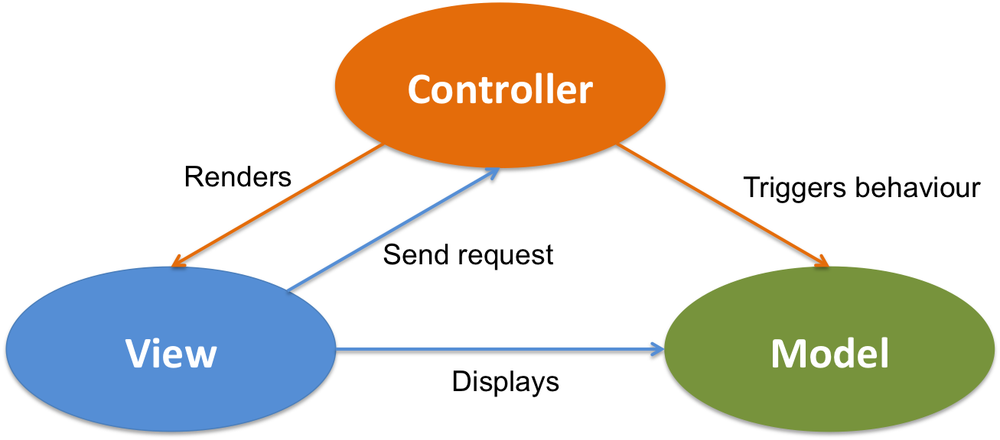
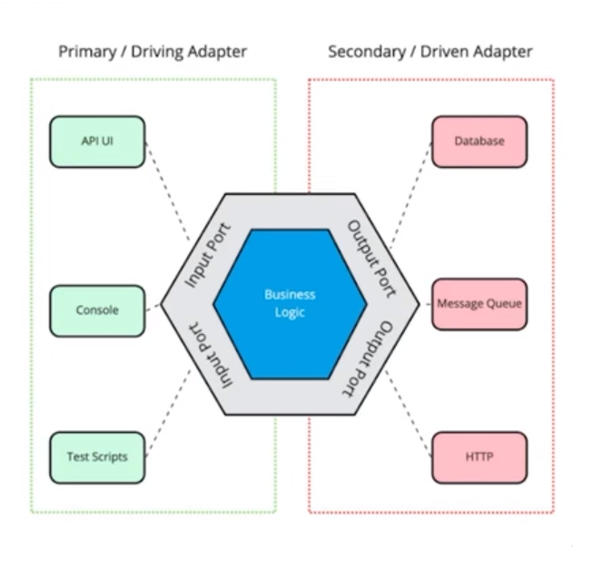
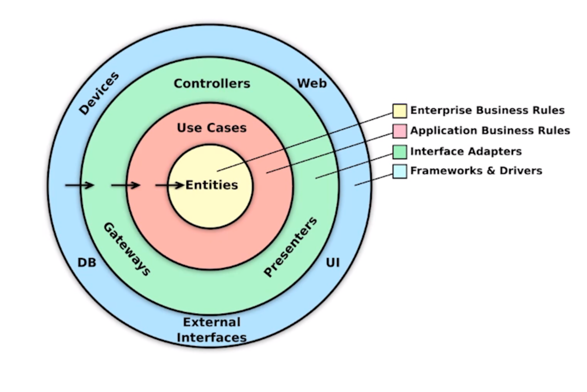
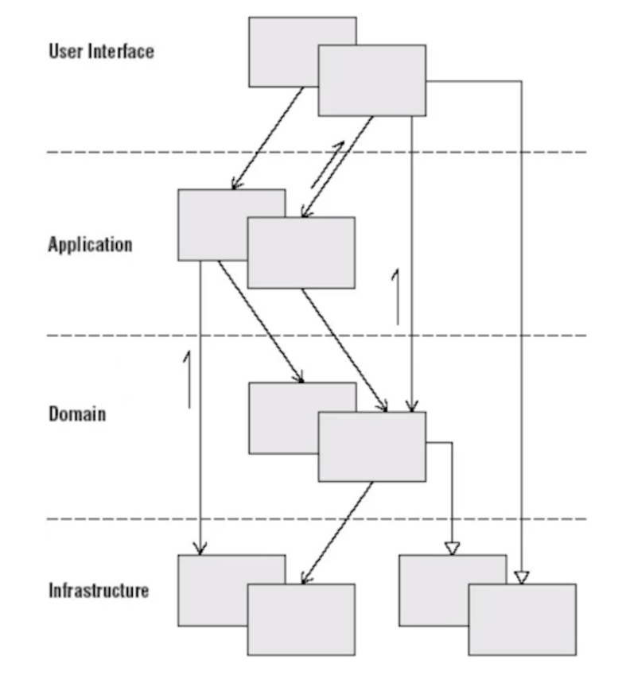
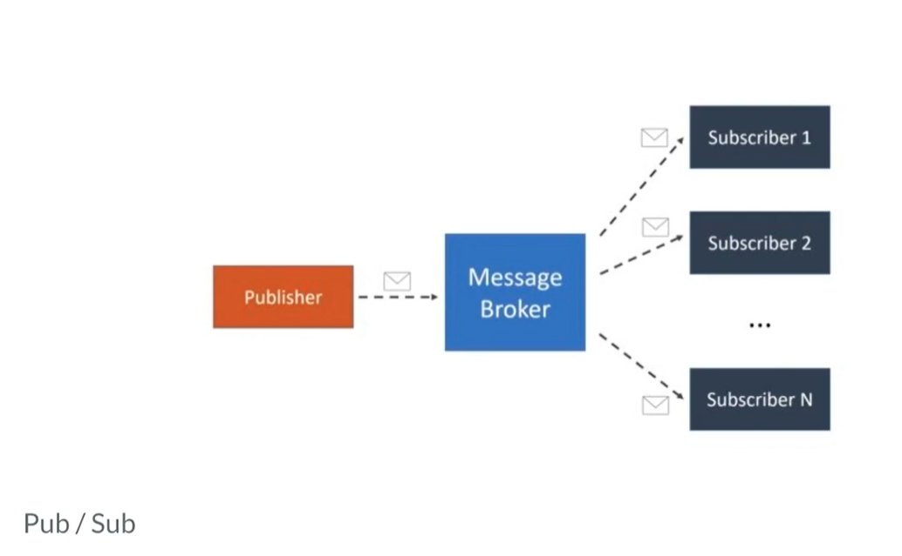
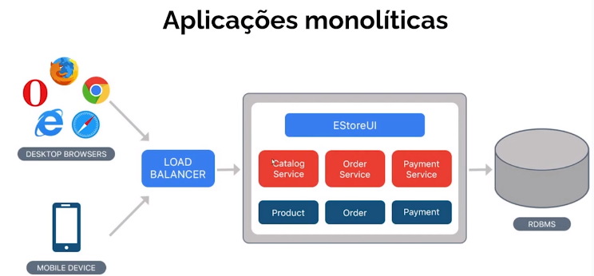
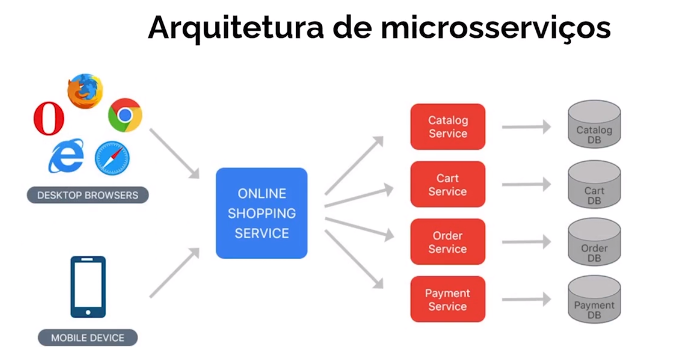

<h1>Engenharia de Software</h1>

**RECOMENDAÇÃO DE LIVRO**: Domain-Driven Design - Eric Evans

* Arquitetura: Visão de mais alto nível da aplicação. Separação de camadas, pastas da aplicação.

* Design de código: Visão de mais baixo nível. Como escrever cada classe, quais padrões de projeto aplicar.
 

* **MVC**:

  

* **Arquitetura Hexagonal (Ports and Adapters):**
    

    * Arquitetura que envolve isolar a regra de negócio em um domínio de tudo o que não faz parte diretamente dele, se comunicando com o domínio através de PORTAS. Cada porta tratará a entrada de forma diferente. Também existirão portas diferentes para quando o domínio queira se comunicar com outro componente da aplicação.
  

* **Arquitetura Limpa:**
    
    
    * Entidades: Classes que possuem uma identidade que a torna única. Classes onde existem as regras de negócio.

    * Casos de Uso/Serviço da aplicação: Classes que organizam o fluxo da regra de negócios para diferentes formas de acesso à aplicação.

    * Controllers: Camada que serve para adaptar ferramentas externas permitindo a comunicar com a interface dos casos de uso.

    * Dispositivos externos: Camada onde não serão aplicadas regras de negócios. Onde ficam dispositivos que comunicam com a plicação principal.
  

* **Design orientada a domínios (DDD - Domain Driven Design):**

    * Filosofia de desenvolvimento na qual é priorizado o desenvolvimento com base das regras de negócio desejadas. É pegar a realidade do negócio e colocar no código.

    * Padrões estratégicos: 
        * Linguagem Ubíqua (onipresente): dar nome igual em todas as etapas do projeto (ex.: Aluno ter a Classe Aluno).

        * Contextos delimitados: Tipos de usos diferentes de uma plataformas.

        * Domínio principal e subdomínios: Domínio mais importante da aplicação e o que não é tão relevante.

        * e outros...

    * Padrões táticos (blocos de construção):
        * Entidades
        * Repositórios (persistência dos dados)
        * Eventos
        * Módulos
        * Serviços (classe que representa uma AÇÃO)
        * e outros...
     
    * Arquitetura em camadas:
    
  

* **Serviço de Mensageria:**

    * Mensageria é um conceito que define que sistemas distribuídos possam se comunicar por meio de _mensagens_ (eventos), sendo estas gerenciadas por um servidor/módulo de mensagem específico chamado _Message Broker_. Este é um intermediário que lidará com requisições de um sistema A para um B.

    * Lida com mensagens assíncronas, que não necessitam de um retorno imediato por parte de quem tá recebendo a mensagem (servidor). 

    * Arquitetura Publisher/Subscriber (Pub/Sub):
    
  
    
* **Modelagem de eventos:**

    * É a forma como um sistema é descrito usando como exemplo como a informação dentro deles se modofica com o tempo.

    * Pode ser iniciada por um brainstorm dentre todas as partes envolvidas no projeto, sugerindo as ações que ocorrem dentro do escopo do projeto, em que são priorizados eventos que modifiquem o estado do sistema.

    * Depois, os eventos serão organizados em uma ordem cronológica, podendo ter interfaces ou telas pra cada evento.

    * Logo após, seraão identificadas as entradas que são necessárias para que cada evento ocorra. Também serão identificadas as saídas após a ocorrência do evento.

    * A estrutura da empresa irá seguir também a estrutura do sistema (lei de Conway).

    * A próxima etapa é criar cenários em que os eventos ocorrem

* **Arquitetura orientada a eventos:**

    * Rever vídeo

* **APIs e Arquitetura REST:**

    * São serviços e rotinas que uma aplicação disponibiliza através de uma interface da qual mostra como utilizar desses serviços sem saber maiores detalhes sobre como são implmentados.

    * APIs mais comuns:
        * **APIs de código fonte:** Disponibiliza uma função de alguma lib ou classe através de uma função.

        * **APIs WEB:** Diponibilzação de serviços web que retornam dados atrvés de funções.
            * RPC (Remote Procedure Call): Faz uma requisição diretamente para uma URL com os argumentos nela mesma.
            * Soap: Faz requisições utilizando XML para facilitar requisições RPC.
            * REST: Utiliza o HTTP como ele deveria ser usado, utilizando os métodos GET, POST, etc como eles foram pensados para serem feitos.
    
    * Arquitetura <a href="https://www.alura.com.br/artigos/rest-conceito-e-fundamentos">REST</a> (Representational State Transfer): é um modelo de arquitetura e não uma linguagem ou tecnologia de programação, que fornece diretrizes para que os sistemas distribuídos se comuniquem diretamente usando os princípios e protocolos existentes da Web sem a necessidade de <a href="https://pt.wikipedia.org/wiki/SOAP">SOAP</a> ou outro protocolo sofisticado.
        * O REST facilita que um servidor possa ser um cliente e um cliente um servidor.
        * O servidor da aplicação não deve guardar sessões, e também não deve saber se o cliente existe caso este não esteja interagindo com o servidor. Então o servidor que envia um doc para o cliente que contém dados para autenticação para conversa entre eles.
        * Utilza da funcionalidade do HyperMedia, que evita modificações no cliente a cada mudança no servidor.
        * <a href="https://www.alura.com.br/artigos/desmistificando-o-protocolo-http-parte-1>">Link sobre protocolo HTTP</a>

* **Arquitetura de Microsserviços:**
    * Aplicações com arquiteturas monolíticas contém todas as suas funcionalidades concentradas em um lugar só. Também as informações podem estar em apenas um banco de dados.
        * Possui alguns problemas como a dependência de todas as funcionalidades da aplicações em caso de falha. Também, ao fazer um deploy, toda a aplicação terá que ser testada, fazendo com que haja uma demora desnecessária. Outra desventagem é que pode sistemas monolíticos só podem utilizar uma tecnologia, a qual será aplicada em todo o projeto.
     
    
     

    * As aplicações de microsserviços conseguem organizar partes das funcionalidades em partes independentes, com tecnologias e bancos de dados independentes da aplicação central, atacando as dificuldades encontradas em aplicações monolíticas.
        * Porém, esse tipo de arquitetura deixa o desenvolvimento, infra, debug e monitoramento dos serviços mais complexo. Por isso, a comunicação entre os serviços (API's) deve ser bem pensada.
     
    
     

    * <a href="https://martinfowler.com/bliki/MonolithFirst.html">Recomenda-se que o sistema seja inicialmente seja desenvolvido _monoliticamente_ para depois ir escalando para _microsserviços_.</a>

    * Arquitetura de Serviços e Microsserviços se diferem no quesito que a primeira já existia e a segunda tem a ver com a primeira, porém no menor tamanho e mais independente possível.

    * Precisa-se verificar a necessidade da aplicação de uma arquitetura monolítica ou de microsserviços, pois uma pode ser melhor que a outra dado o contexto.

