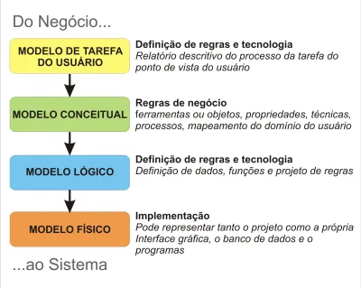

<h1>Modelagem de Dados</h1>

<h2>Entidades, relacionamentos e atributos Modelagem de banco de dados: entidades, relacionamentos e atributos</h2>

* A entrevista é essencial para se construir um projeto de BD coerente com a necessidade do cliente. Antes porém, o responsável pelo projeto deve entender o contexto da situação, para que as perguntas relativas à construção do sistema sejam pertinentes e essenciais ao projeto.

* MER -> Modelo Entidade-Relacionamento (Conceitual): usado para descrever objetos, suas características e como se relacionam

* DER -> Diagrama Entidade-Relacionamento (Lógico): representação gráfica do MER, geralmente usado como sinônimo do MER

* Entidade: objeto, abstrato ou não, único no mundo real. Ex: Clientes, Carros, Departamento...
	* FORTE: Existe independentemente de outra entidade
	* FRACA: Precisa de outra entidade para existir

* Fluxo para definição de cardinalidade pode variar a ordem: Entidade -> relacionamento -> cardinalidade, Entidade -> cardinalidade -> relacionamento

* Tipos de restrições de relacionamentos entre entidades:
    * **Restrição total:** Ocorre quando todas as instâncias de uma entidade X precisam estar obrigatoriamente relacionadas a alguma instância da entidade Y. Exemplo sendo que um colaborador, para trabalhar numa empresa, deve estar associado a algum departamento. (relacionamento 'associar')

    * **Restrição parcial:** Ocorre o contrário da restrição total, em que uma entidade X não precisa estar obrigatóriamente associada a outra Y. No mesmo exemplo anterior, um empregado deve sim estar associado a um departamento, e todo departamento deve ter um empregado como gerente. Logo, somente um empregado deve ser gerente, não todos. (relacionamento 'gerencia')

* Todo relacionamento muitos-para-muitos pode ser entendido como uma entidade. Essas entidades denominam-se associativas, pois elas representam um fato, um relacionamento muitos-para-muitos.

* Todo relacionamento com uma entidade fraca é um relacionamento fraco.

* Atributos são características de uma entidade. Se algo não houver características, muito provavelmente este é um atributo de uma outra entidade.

* Os atributos:
    * Devem ser **atômicos**, ou seja, devem representar apenas um **aspecto** da entidade
    * Podem agrupar mais de um valor por vez (multivalorados)
    * Podem ser derivados, ou seja, podem ser descobertos a partir de outros atributos/informações
    * Podem ser obrigatórios (Not NULL) ou não
    * Podem ser chaves primárias (identificadores de itens da própria) e chaves estrangeiras (identificadores de outras entidades).

* Somente entidades fortes possuem chaves primárias. A chave primária se refere a um ou mais campos cujos valores, considerando a combinação de valores em caso de mais de um campo, nunca se repetem na mesma tabela.

* Quando uma entidade forte não tiver inicialmente um atributo do qual pode ser utilizado como chave primária, pode-se criar um para servir (com o nome 'id' por exemplo). Geralmente acontece em casos na qual a entidade forte em questão possui generalizações, ou seja, entidades que derivam desta e que cada uma possui um possível identificador próprio. 

* Caso uma entidade fraca poder possuir um atributo identificador (candidado a ser primário), este será uma _chave parcial_. Este será o identificador para a entidade em questão, porém deverá ser acompanhado da chave primária da entidade forte da qual ela tem relacionamento.

* Links Úteis:
    * <a href="https://www.alura.com.br/artigos/mer-e-der-funcoes">MER e DER: Definições, Banco de Dados e Exemplos</a>
    * <a href="https://www.remessaonline.com.br/blog/mer-e-der-o-que-e-as-principais-diferencas-e-como-usar/">MER e DER: o que é, as principais diferenças e como usar</a>

<h2>Modelagem de banco de dados relacional: modelagem lógica e física</h2>

* Modelo Conceitual: Modelo mais alto nível da representação do banco de dados que se deseja implementar. Envolve somente definir os atributos, entidades, relacionamentos e especificações do projeto sem entrar em detalhes de implementação.

* Modelo Lógico: Modelo intermediário entre o físico e o abstrato. Tem a responsabilidade de já trazer uma visualização prévia em tabelas (relações) sobre a forma como tudo o que está no Modelo Conceitual ficará dentro do Banco de Dados. Ele descreve como os dados serão armazenados no banco de dados, identificando as entidades, os atributos, as chaves primárias e estrangeiras e os seus relacionamentos.

* Modelo Físico: Modelo que se trata da própria implementação do projeto no Banco de Dados. Pode ser um Modelo Lógico mais detalhado ou até o próprio código SQL que o implementa.

* Nomes de tabelas em **maiúsculo** e nomes de atributos/colunas/campos em **minúsculo**.

* As diferenças entre entidades fortes e fracas dentro do modelo lógico/físico é:
    * Todas as relações fortes possuem chaves primárias.
    * Uma entidade fraca sempre depende de uma entidade forte para sua existência, representada por uma chave estrangeira, mas ela pode possuir uma chave identificadora, conhecida como chave parcial.

* Relações de n para n possuem chaves estrangeiras das duas relações participantes, sendo elas um par para chave primária.

* Para especializações de uma entidade, criar novas relações que tenham como chave primária e estrangeira, a primária de onde se especializam.

* Por vezes é identificado em uma modelagem, atributos de um relacionamento entre duas entidades, como o famoso e clássico caso de Empregado e Departamento. E dependendo da cardinalidade do relacionamento, estes atributos podem ou não se mover para uma das entidades. Os casos são:
    * (1:1): Os atributos podem ser movidos para qualquer uma das entidades envolvidas.
    * (1:n): Os atributos serão movidos para a entidade com a cardinalidade N.
    * (n:m): Será criada uma _entidade associativa_ para este relacionamento, que conterá todos os atributos das entidades participantes do relacionamento + os atributos do relacionamento em si.

* O SQL Power Architect mexe com a modelagem física. Existem outros softwares tbm que mexem com isso tipo o _MySQL Workbench_, o _Astah_ e o _DBDesigner_.

* O domínio de um dado são os valores possíveis que este pode assumir. Desde tipo até valores específicos. Dentre eles temos:
    * Para valores numéricos:
        * Int armazena valores numéricos inteiros.
        * Float armazena valores numéricos aproximados com precisão de ponto flutuante.
        * Decimal armazena valores numéricos com casas decimais, utilizando precisão.
    * Para valores de texto (strings):
        * Varchar armazena valores de string de tamanho variável de acordo com o seu limite. Precisão é a qtd de caracteres possível.
        * Char armazena valores de string de tamanho fixo.
        * Text armazena valores de string de tamanho variável.
    * Para valores com datas e horários:
        * Date armazena apenas valores de data.
        * Time armazena apenas valores de hora.
        * Timestamp armazena valores de data e hora.

* 