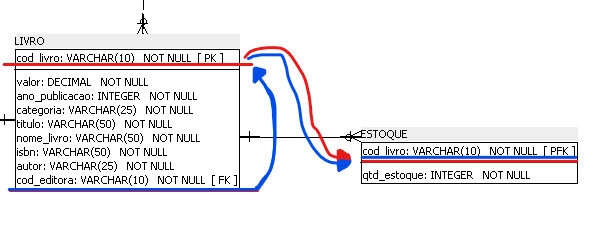
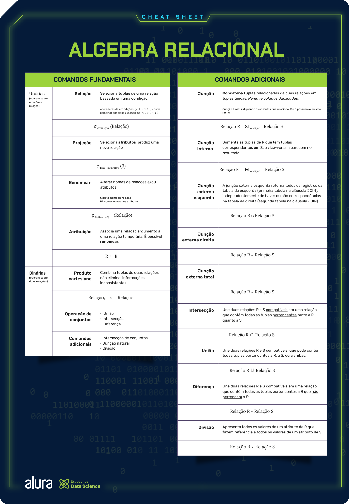

<h1>Modelagem de Dados</h1>

<h2>Entidades, relacionamentos e atributos Modelagem de banco de dados: entidades, relacionamentos e atributos</h2>

* A entrevista é essencial para se construir um projeto de BD coerente com a necessidade do cliente. Antes porém, o responsável pelo projeto deve entender o contexto da situação, para que as perguntas relativas à construção do sistema sejam pertinentes e essenciais ao projeto.

* MER -> Modelo Entidade-Relacionamento (Conceitual): usado para descrever objetos, suas características e como se relacionam

* DER -> Diagrama Entidade-Relacionamento (Lógico): representação gráfica do MER, geralmente usado como sinônimo do MER

* Entidade: objeto, abstrato ou não, único no mundo real. Ex: Clientes, Carros, Departamento...
	* FORTE: Existe independentemente de outra entidade
	* FRACA: Precisa de outra entidade para existir

* Fluxo para definição de cardinalidade pode variar a ordem: Entidade -> relacionamento -> cardinalidade, Entidade -> cardinalidade -> relacionamento

* Tipos de restrições de relacionamentos entre entidades:
    * **Restrição total:** Ocorre quando todas as instâncias de uma entidade X precisam estar obrigatoriamente relacionadas a alguma instância da entidade Y. Exemplo sendo que um colaborador, para trabalhar numa empresa, deve estar associado a algum departamento. (relacionamento 'associar')

    * **Restrição parcial:** Ocorre o contrário da restrição total, em que uma entidade X não precisa estar obrigatóriamente associada a outra Y. No mesmo exemplo anterior, um empregado deve sim estar associado a um departamento, e todo departamento deve ter um empregado como gerente. Logo, somente um empregado deve ser gerente, não todos. (relacionamento 'gerencia')

* Todo relacionamento muitos-para-muitos pode ser entendido como uma entidade. Essas entidades denominam-se associativas, pois elas representam um fato, um relacionamento muitos-para-muitos.

* Todo relacionamento com uma entidade fraca é um relacionamento fraco.

* Atributos são características de uma entidade. Se algo não houver características, muito provavelmente este é um atributo de uma outra entidade.

* Os atributos:
    * Devem ser **atômicos**, ou seja, devem representar apenas um **aspecto** da entidade
    * Podem agrupar mais de um valor por vez (multivalorados)
    * Podem ser derivados, ou seja, podem ser descobertos a partir de outros atributos/informações
    * Podem ser obrigatórios (Not NULL) ou não
    * Podem ser chaves primárias (identificadores de itens da própria) e chaves estrangeiras (identificadores de outras entidades).

* Somente entidades fortes possuem chaves primárias. A chave primária se refere a um ou mais campos cujos valores, considerando a combinação de valores em caso de mais de um campo, nunca se repetem na mesma tabela.

* Quando uma entidade forte não tiver inicialmente um atributo do qual pode ser utilizado como chave primária, pode-se criar um para servir (com o nome 'id' por exemplo). Geralmente acontece em casos na qual a entidade forte em questão possui generalizações, ou seja, entidades que derivam desta e que cada uma possui um possível identificador próprio. 

* Caso uma entidade fraca poder possuir um atributo identificador (candidado a ser primário), este será uma _chave parcial_. Este será o identificador para a entidade em questão, porém deverá ser acompanhado da chave primária da entidade forte da qual ela tem relacionamento.

* Links Úteis:
    * <a href="https://www.alura.com.br/artigos/mer-e-der-funcoes">MER e DER: Definições, Banco de Dados e Exemplos</a>
    * <a href="https://www.remessaonline.com.br/blog/mer-e-der-o-que-e-as-principais-diferencas-e-como-usar/">MER e DER: o que é, as principais diferenças e como usar</a>

<h2>Modelagem de banco de dados relacional: modelagem lógica e física</h2>

* Modelo Conceitual: Modelo mais alto nível da representação do banco de dados que se deseja implementar. Envolve somente definir os atributos, entidades, relacionamentos e especificações do projeto sem entrar em detalhes de implementação.

* Modelo Lógico: Modelo intermediário entre o físico e o abstrato. Tem a responsabilidade de já trazer uma visualização prévia em tabelas (relações) sobre a forma como tudo o que está no Modelo Conceitual ficará dentro do Banco de Dados. Ele descreve como os dados serão armazenados no banco de dados, identificando as entidades, os atributos, as chaves primárias e estrangeiras e os seus relacionamentos.

* Modelo Físico: Modelo que se trata da própria implementação do projeto no Banco de Dados. Pode ser um Modelo Lógico mais detalhado ou até o próprio código SQL que o implementa.

* Nomes de tabelas em **maiúsculo** e nomes de atributos/colunas/campos em **minúsculo**.

* As diferenças entre entidades fortes e fracas dentro do modelo lógico/físico é:
    * Todas as relações fortes possuem chaves primárias.
    * Uma entidade fraca sempre depende de uma entidade forte para sua existência, representada por uma chave estrangeira, mas ela pode possuir uma chave identificadora, conhecida como chave parcial.

* Relações de n para n possuem chaves estrangeiras das duas relações participantes, sendo elas um par para chave primária.

* Para especializações de uma entidade, criar novas relações que tenham como chave primária e estrangeira, a primária de onde se especializam.

* Por vezes é identificado em uma modelagem, atributos de um relacionamento entre duas entidades, como o famoso e clássico caso de Empregado e Departamento. E dependendo da cardinalidade do relacionamento, estes atributos podem ou não se mover para uma das entidades. Os casos são:
    * (1:1): Os atributos podem ser movidos para qualquer uma das entidades envolvidas.
    * (1:n): Os atributos serão movidos para a entidade com a cardinalidade N.
    * (n:m): Será criada uma _entidade associativa_ para este relacionamento, que conterá todos os atributos das entidades participantes do relacionamento + os atributos do relacionamento em si.

* O SQL Power Architect mexe com a modelagem física. Existem outros softwares tbm que mexem com isso tipo o _MySQL Workbench_, o _Astah_ e o _DBDesigner_.

* O domínio de um dado são os valores possíveis que este pode assumir. Desde tipo até valores específicos. Dentre eles temos:
    * Para valores numéricos:
        * Int armazena valores numéricos inteiros.
        * Float armazena valores numéricos aproximados com precisão de ponto flutuante.
        * Decimal armazena valores numéricos com casas decimais, utilizando precisão.
    * Para valores de texto (strings):
        * Varchar armazena valores de string de tamanho variável de acordo com o seu limite. Precisão é a qtd de caracteres possível.
        * Char armazena valores de string de tamanho fixo.
        * Text armazena valores de string de tamanho variável.
    * Para valores com datas e horários:
        * Date armazena apenas valores de data.
        * Time armazena apenas valores de hora.
        * Timestamp armazena valores de data e hora.

* Não precisamos colocar duas chaves primárias estrangeiras que vem de uma outra entidade, pois uma já está fazendo o papel de chave primária e de chave estrangeira. (?)

* Existem dois tipos de identificação de relacionamentos dentro do Power Architect:
    * **Identificador**: É aquele na qual uma ocorrência da entidade fraca, precisa estar associada a exatamente uma ocorrência da entidade forte e não pode existir sem ela. Nesse caso, esse relacionamento é utilizado para representar uma chave primária estrangeira.

    * **Não identificador**: Cada ocorrência da entidade fraca pode ser identificada sem a necessidade de saber a qual ocorrência da entidade forte está associada. É utilizado para representar apenas chaves estrangeiras.

* Um tipo de representação comum de relacionamentos dentro de vários modelos físicos chama-se <a href="https://cursos.alura.com.br/forum/topico-cardinalidade-entre-produto-e-estoque-241385">_Pé de galinha_</a>.

<h2>Modelagem de banco de dados relacional: álgebra relacional</h2>

* **Álgebra relacional:** Teoria matemática que forma a base dos bancos de dados relacionais. Ela é implementada pela linguagem SQL dentro dos SGBD's relacionais. As operações mais comuns são:
    * _Seleção_: (Operação a se realizar no DB, como se fosse um corte horizontal na tabela de dados) é implementado como WHERE em SQL.
        * Sintaxe: σ condição (Relação)
    * _Projeção_: (Escolha dos dados que se deseja mostrar/utilizar) é implementado como a lista de colunas que você escolhe após a palavra SELECT em SQL.
        * Sintaxe: π coluna desejada (σ(Se quiser colocar uma consdição de seleção)(Relação))
    * _União_: (É a combinação de dois conjuntos, tendo elementos iguais ou não) é representado pelo UNION em SQL.
        * Sintaxe: π coluna_tal (Relação1) ∪ π coluna_tal (Relação2)
    * _Intersecção_: (É a combinação de dois conjuntos, tendo somente elementos iguais a ambos)
        * Sintaxe: π coluna_tal (Relação1) ∩ π coluna_tal (Relação2)
    * _Diferença_: (É idêntica a operação de subtração da matemática, onde se tem dois conjuntos e tira-se todos os elementos que não do primeiro conjunto que não se relacionam com os do segundo) é implementado como EXCEPT em SQL.
        * Sintaxe: π coluna_tal (Relação1) - π coluna_tal (Relação2)
    * _Divisão_: (Resulta nas linhas que a coluna do conjunto da direita estão dentro das linhas do conjunto da esquerda)
        * Sintaxe: π coluna_tal (Relação1) ÷ π coluna_tal (Relação2)
    * _Produto Cartesiano_: (É a combinação de todos os registros das relações. Ex. Livros tem 20 registros e Cliente tem 10. O PC terá 200 linhas) é implementado como um JOIN sem condição ou CROSS JOIN em SQL. **OBS**. Operação custosa, pois aumenta exponencialmente a cada novo registro em qq das relações
        * Sintaxe: Relação1 x Relação2
    *_Junção_: É a junção entre duas tabelas que resultam em uma outra relação da qual possue seus registros com valores qe são iguais entre as colunas de ambas relações originais. 
        * Sintaxe : σ condição (Relação1 x Relação2), que pode ser substituída por (Relação1 ⨝ (condição) Relação2)
    Tem os tipos:
        * _Natural_: Quando as colunas das relações originais em questão possuem o mesmo nome, não há necessidade de deixar explícito a condição de ligação 
            * Sintaxe: (Relação1 ⨝ Relação2)
        * _À esquerda_: Puxa todas as linhas da relação à esquerda, mesmo as que não tenham ligação com a da direita.
            * Sintaxe: (Relação1 ⟕ Relação2)
        * _À direita_: Puxa todas as linhas da relação à direita, mesmo as que não tenham ligação com a da esquerda.
            * Sintaxe: (Relação1 ⟖ Relação2)

    * A diferença principal entre _junção_ e _união e intersecção_ é que a primeira exige uma coluna comum a ambas relações que estão sendo colocadas ali, ao contrário da segunda.

* Tabela de operações algébricas relacionais:
 

 

* **EXERCÍCIO DE PRÁTICA DE ÁLGBEBRA RELACIONAL**:
    * Quais são os nomes dos livros que possuem preço maior que R$50?
        * R: π nome_livro (σ(preco > 50)(Livros))

    * Quais são os vendedores que possuem mais de 5 anos de experiência?
        * R: σ (anos_exp > 5)(Vendedor)

    * Quais são os códigos de livros recomendados pela revista ‘BestBooks Magazine’?
        * R: π id_livro (σ(fonte_recomendacao = 'BestBooks Magazine')(LivrosRecomendados))

    * Quais são os livros com estoque menor que 20 unidades?
        * R: σ (qtd_estoque < 20)(Livros)

    * Quais são os códigos dos livros mais vendidos durante o ano de 2021?
        * R: π id_livro (σ(ano = 2021)(LivrosMaisVendidos))

    * Quais são os livros com preço entre R$30 e R$50?
        * R: σ (preco >= 30 AND preco <= 50)(Livros)

    * Existe algum livros sem exemplar em estoque? Quais?
        * R:  σ (qtdEstoque = 0)(Livros)

    * Quais são os livros que custam mais de R$ 50 e contém mais de 5 unidades no estoque?
        * R: σ (qtdEstoque > 5 AND preco > 50)(Livros)

    * Quais livros atendem os requisitos do amigo oculto do cliente André: ser um livro de George Orwell ou de qualquer outra autoria que seja mais caro que 30 reais?
        * R: σ (autor = 'George Orwell' OR preco > 30)(Livros)

    * Qual o nome e preço dos livros que custam até 30 reais?
        * R :π nome_livro, preco (σ(preco <= 30)(Livros)) 

    * Quais livros da “Colleen Houck” venderam mais de 3 exemplares em um único pedido?
        * R: σ (Livros.autor = 'Colleen Houck' AND Vendas.qtd_vendida > 3) (Livros ⨝ Vendas)

    * Quais são os livros que tiveram vendas acima de 10 unidades em um único pedido OU possuem preço total igual a R$20?
        * R: σ (Vendas.qtd_vendida > 10 OR Livros.preco = 20) (Livros ⟕ Vendas)

    * Qual o nome dos livros mais recomendados com nota média superior a 4.3?
        * R: π Livros.nome_livro σ (LivrosRecomendados.nota_media > 4.3) (Livros ⨝ LivrosRecomendados)

* Para renomear relações, utilizamos a sigla 'ρ'(Rô) na relação em questão. Esta operação é útil quando se deseja comparar registros de uma tabela com ela mesma. É possível també, renomear atributos
    * Para relações: σ (NovoNome.attr1 > Relação.attr1 = 20) (ρ NovoNome Relação x Relação)
    * Para atributos: ρ novoNome <- nomeOriginal (Relação)

* Toda operação entre conjuntos gera um novo conjunto (relação), e é possível associá-lo a uma 'variável' através do sinal de igual '=':
    * Exemplo: novaRelação = σ (NovoNome.attr1 > Relação.attr1 = 20) (ρ NovoNome Relação x Relação); novaRelação x Relação2

    * OBS: o símbolo de atribuição no Relax (=) é diferente da literatura formal (←);

* <a src="https://coens.dv.utfpr.edu.br/will/wp-content/uploads/2022/03/Apostila_Algebra_Relacional.pdf">Link para livro de álgebra relacional</a>

* <a src="https://dbis-uibk.github.io/relax/calc/gist/41cf5ce652756d9331eec7562644e074/imdbsample/0">Link com dados já carregados no RelaX</a>

* <a href="https://www.alura.com.br/artigos/banco-dados-relacionais-conceitos-terminologias-ferramentas">Link para termos gerais de BDRs</a>

<h2>Modelagem de banco de dados relacional: normalização</h2>

* A redundância (no sentido da repetição) de dados dentro de tabelas podem ser chamado de _anomalias_. Estas anomalias podem gerar alguns tipos de inconsistência dentro de um BD, sendo três delas de:
    * _Inserção_: repetição de dados a cada inserção de um item em uma tabela (Ex. Valor, data, cliente de um pedido repetidos);
    * _Alteração_: modificação de diversas linhas que carregam uma informação em comum (Ex. Alterar o nome de um autor precisaria alterar várias linhas de pedidos que ele tenhm livros dele), podendo gerar inconsistências;
    * _Remoção_: remoção de dados necessários dentro do banco de dados (Ex. Remover um livro que contenha as informações de seu autor e da editora);

* Para buscar atacar essas anomalias acima mencionadas, utilizamos de um conjunto de critérios para definir a qualidade de um esquema de relações dento do DB, sendo algumas:
    * Evitar a presença de colunas com valores vazios, pois não é ideal dentro da estrutura do DB;
    * Evitar redundância de informações;
    * Ter uma semântica clara com esquemas fáceis de explicar e de entender;
    * Evitar o surgimento de tuplas (registros) falsos dentro de uma relação (tabela);

* 

